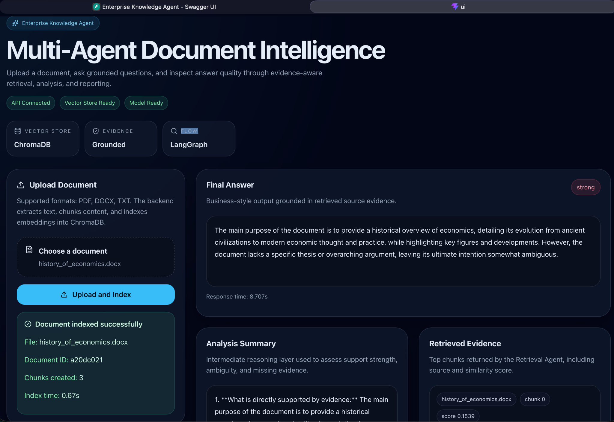
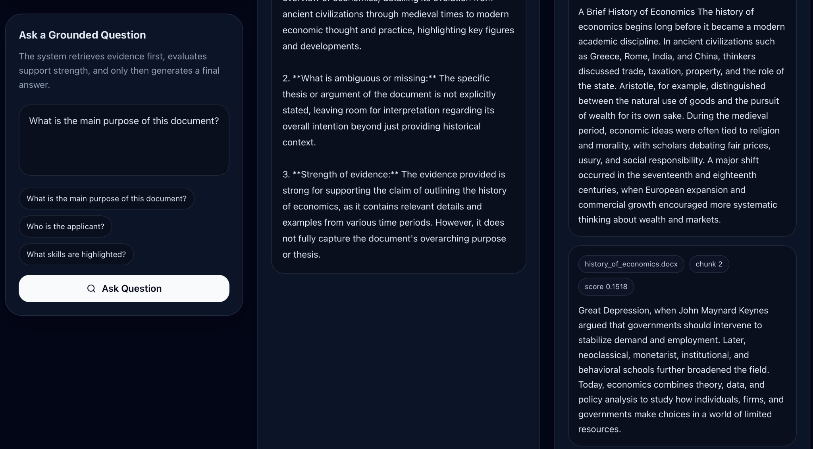

# Enterprise Knowledge Agent

A production-minded multi-agent RAG system for grounded document Q&A using FastAPI, LangGraph, ChromaDB, and React.

This project allows users to upload PDF, DOCX, and TXT documents, index them into a vector store, and ask grounded questions through a clean demo interface. The system retrieves relevant chunks, evaluates evidence quality, and returns a final answer together with an analysis summary and source evidence.

---

## What it does

- accepts PDF, DOCX, and TXT uploads
- extracts and chunks document text
- stores embeddings in ChromaDB
- runs a LangGraph workflow with:
  - Retrieval Agent
  - Analysis Agent
  - Report Agent
- returns:
  - final answer
  - analysis summary
  - evidence quality flag
  - retrieved evidence chunks
- displays measured timing for:
  - indexing
  - query execution

---

## Why this project matters

Many document-Q&A demos stop at a basic retrieval pipeline and a final generated answer.

This project is designed to go one step further:

- it separates retrieval, evidence analysis, and answer generation
- it exposes evidence quality instead of hiding uncertainty
- it makes the system easier to reason about as a product, not only as a model call
- it demonstrates a more architect-oriented way of thinking about GenAI workflows

This makes the project more suitable as a portfolio asset for a **GenAI Solutions Engineer / Solutions Architect track**.

---

## Architecture overview

### High-level flow

1. User uploads a document
2. Backend extracts the text
3. Text is split into chunks
4. Chunks are embedded and stored in ChromaDB
5. User asks a grounded question
6. Retrieval Agent fetches relevant chunks
7. Analysis Agent checks whether the evidence is actually sufficient
8. Report Agent generates the final grounded answer
9. UI shows:
   - answer
   - analysis summary
   - evidence quality
   - retrieved source chunks

---

## Architecture decisions

### Why FastAPI
FastAPI was chosen because it provides a clean and lightweight backend structure for file upload, indexing, and query orchestration. It is well-suited for modular MVPs and easy to extend into service-oriented architectures later.

### Why LangGraph
LangGraph was used to make the retrieval, analysis, and reporting steps explicit rather than hiding everything inside a single chain.

This improves:
- interpretability
- extensibility
- separation of responsibilities
- portfolio clarity

### Why ChromaDB
ChromaDB was selected for the MVP because it is simple to run locally and integrates well with embedding-based retrieval workflows.

For a larger production setup, this could later be replaced with a more scalable managed vector database if required.

### Why a multi-agent structure
Instead of going directly from query to answer, the workflow is intentionally split into:
- retrieval
- analysis
- reporting

This separation better reflects how enterprise-grade AI systems should reason about evidence rather than only produce fluent outputs.

### Why evidence quality is exposed
A major weakness of many GenAI demos is that they produce confident-looking answers even when evidence is weak.

This project introduces a visible `evidence_quality` signal to make uncertainty explicit and reduce blind trust in the final answer.

---

## Trade-offs

### Why not a single-chain RAG pipeline?
A simpler chain would require less code and fewer moving parts.

However, the multi-agent structure was preferred because it:
- better demonstrates system design thinking
- makes the reasoning flow easier to explain
- creates a stronger foundation for future extensions

### Why not multi-user auth in v1?
Authentication and user isolation were intentionally excluded from the MVP to keep the focus on grounded retrieval quality, evidence handling, and UI clarity.

A production version would add:
- authentication
- user/session isolation
- role-based access
- document scoping

### Why local persistence for now?
The current version is optimized for:
- fast local setup
- clear portfolio demonstration
- easy reproducibility

It is intentionally not yet optimized for:
- multi-user concurrency
- large-scale storage
- long-running hosted environments

---

## Demo preview

### Overview


### Analysis and Evidence View


---

## Project structure

```text
enterprise-knowledge-agent/
├── app/
│   ├── api/
│   ├── core/
│   ├── services/
│   └── data/
├── sample_docs/
├── tests/
├── ui/
│   ├── src/
│   └── ...
├── docs/
│   └── images/
├── .env.example
├── .gitignore
├── README.md
└── requirements.txt
```

---

## Local setup

### 1. Create and activate a virtual environment

```bash
python3 -m venv .venv
source .venv/bin/activate
```

### 2. Install backend dependencies

```bash
pip install -r requirements.txt
```

### 3. Create the environment file

```bash
cp .env.example .env
```

### 4. Add your OpenAI API key to `.env`

```env
OPENAI_API_KEY=your_api_key_here
OPENAI_CHAT_MODEL=gpt-4o-mini
OPENAI_EMBEDDING_MODEL=text-embedding-3-small
CHROMA_PERSIST_DIR=app/data/chroma
UPLOAD_DIR=app/data/uploads
LOG_LEVEL=INFO
TOP_K_RESULTS=5
MAX_CHUNK_SIZE=800
CHUNK_OVERLAP=120
MAX_FILE_SIZE_MB=10
COLLECTION_NAME=enterprise_knowledge_agent
```

### 5. Start the backend

```bash
python -m uvicorn app.main:app --reload
```

Backend runs at:

```text
http://127.0.0.1:8000
```

API docs:

```text
http://127.0.0.1:8000/docs
```

### 6. Start the frontend

```bash
cd ui
npm install
npm run dev
```

Frontend runs at:

```text
http://127.0.0.1:5173
```

---

## Main API endpoints

### Health
- `GET /health`

### Upload
- `POST /upload`

### Query
- `POST /query`

---

## Example workflow

1. Upload a document
2. Wait for indexing to complete
3. Ask a grounded question such as:
   - `What is the main purpose of this document?`
   - `Who is the applicant?`
   - `What skills are highlighted?`
4. Inspect:
   - final answer
   - analysis summary
   - evidence quality
   - retrieved source chunks

---

## Weak-evidence behavior

One of the key goals of this project is not just answering questions, but doing so responsibly.

The system is designed to behave differently depending on evidence strength.

### Directly supported question
If the document clearly supports the answer, the system should return:
- a grounded answer
- a useful analysis summary
- retrieved chunks with supporting evidence
- a reasonable evidence quality signal

### Partially supported question
If the document only partially supports the answer, the system should:
- answer conservatively
- highlight ambiguity
- avoid inventing missing details
- reflect this in the analysis summary

### Unsupported question
If the question is not supported by the uploaded document, the system should:
- avoid confident hallucination
- signal weak evidence
- make the lack of support visible through the analysis layer

This behavior is one of the most important differentiators of the project.

---

## Example evaluation scenarios

### Scenario 1 — Directly supported
**Question:**  
`What is the main purpose of this document?`

**Expected behavior:**  
A grounded summary based on retrieved chunks, with evidence quality reflecting the available support.

### Scenario 2 — Partially supported
**Question:**  
`What long-term projects does the applicant want to lead?`

**Expected behavior:**  
The system should acknowledge that motivation may be present, but that explicit future project ownership may not be clearly stated.

### Scenario 3 — Unsupported
**Question:**  
`What is the company revenue forecast for 2027?`

**Expected behavior:**  
The system should show weak evidence and avoid generating a fabricated answer.

---

## Benchmark snapshot

> Replace the example values below with your own measured values if they change after additional testing.

| Test Case | Document Type | Chunks Created | Index Time | Query Time | Evidence Quality | Result |
|---|---:|---:|---:|---:|---|---|
| Motivation Letter | PDF | 2 | 2.8s | 3.1s | Medium | Correct |
| Policy Note | TXT | 1 | 0.8s | 2.0s | High | Correct |
| Resume / Profile | DOCX | 1 | 1.7s | 4.2s | Weak | Partially correct |

---

## What this project demonstrates

This project is designed to show capability in:

- modular GenAI application design
- multi-agent workflow orchestration
- grounded document question answering
- evidence-aware answer generation
- retrieval transparency
- backend/frontend integration
- production-minded MVP thinking
- measurable system behavior through timing metrics

---

## Current limitations

This is an MVP and not a full production deployment.

Current limitations:

- no authentication
- no multi-user document isolation
- no async background indexing jobs
- no hosted deployment by default
- no advanced observability or tracing stack
- no reranking layer beyond the current retrieval flow
- limited benchmark coverage

---

## Production path

This project is intentionally scoped as a production-minded MVP, not a full enterprise deployment.

If expanded into a real production system, the next architectural steps would be:

- add authentication and user/session isolation
- replace local-only persistence with a hosted storage strategy
- move indexing into async background jobs
- add document management across multiple uploads
- improve retrieval quality through reranking and evaluation loops
- introduce tracing, observability, and failure monitoring
- add environment-based deployment configuration and secret management
- support team-based usage and permissions

The current version focuses on the most important first step:
making document-grounded GenAI responses explainable, measurable, and evidence-aware.

---

## Future improvements

- authentication and session isolation
- hosted vector store option
- reranking layer for retrieval quality
- better document management across multiple uploads
- evaluation suite for weak-evidence and unsupported queries
- observability and tracing
- public demo deployment
- richer UI tooltips for evidence interpretation

---

## Portfolio context

This project is part of a broader architect-track portfolio focused on:

- GenAI applications
- evidence-aware workflows
- AI operations and governance
- production-minded AI system design

Within that portfolio, this project represents the **application layer**:
a grounded GenAI workflow that turns uploaded documents into explainable, reviewable answers.

---

## Author

**Zamil Hasanov**

- LinkedIn: https://www.linkedin.com/in/zamillion/
- GitHub: https://github.com/Zamil00